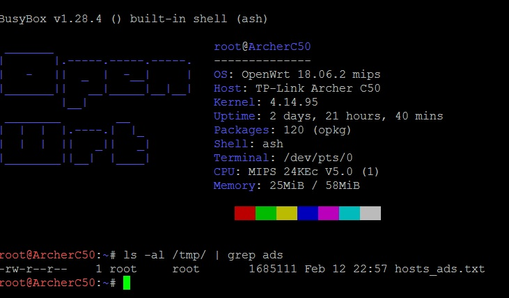

# openwrt-utils

<p align="center">
  
</p>

## Requirements :

* OpenWrt \>= 15.01
* 8MB (flash)/64MB (RAM) router at least.

## Direct install

Access to your router via ssh, and download the script.<br><br>
**You may need to update wget for ssl support** :
```
# opkg update
# opkg install libustream-openssl ca-bundle ca-certificates
# opkg install wget --force-reinstall
```

Install :
```
sh -c "$(wget "https://raw.githubusercontent.com/raymas/openwrt-utils/master/install.sh" -O -)"
```

## Contributing

Please read [CONTRIBUTING.md]() for details on our code of conduct, and the process for submitting pull requests to us.

## Authors

* **raymas** - *Initial work* - [raymas](https://github.com/raymas)

See also the list of [contributors](https://github.com/raymas/Rover/contributors) who participated in this project.

## License

This project is licensed under the MIT License - see the [LICENSE.md](LICENSE.md) file for details
